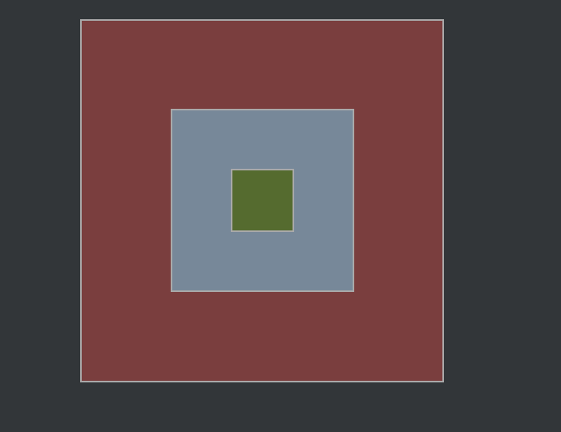

## Event Listeners

Imagine que o EventListener é um vigia que você coloca em cima de um elemento. Você diz para ele: "Fica de olho. Se alguém 'clickar' em voce, essa função aqui".

Nós transformamos um elemento em um ouvinte.

<br>

## syntax
- Selecionamos o elemento que vamos 'transformar' em um listener
     - informa o tipo do evento
     - qual a function que vai ser executada

<br>

```html
<body>
     <!-- paizao -->
     <div id="paizao">
          <!-- paizin -->
          <div id="pai">
               <!-- filho -->
               <div id="filho"></div>
          </div>
     </div>
     <script type="module" src="testando.js"></script>
</body>
```

<br>



<br>

```js
let divPaizao = document.querySelector("div#paizao");
let divPai = document.querySelector("#pai");
let divFilho = document.querySelector("#filho");


//todo listener vai executar essa function
const printar = function (){
     console.log("elemento foi apertado!");
}

divPaizao.addEventListener("click", printar);
```

<br>


📖 Perceba que clicando ate mesmo nas divs 'filhas', ainda assim o evento é executado. Isso, porque os elementos filhos tambem estão DENTRO do elemento listener. É como se voce tivesse clicada no elemento pai, mesmo clicando no fiho. Isso eh chamado de **Bubbling**.


<hr>
<br>

## Podemos passar a function na hora da criacao do evento

```js
let divPaizao = document.querySelector("div#paizao");
let divPai = document.querySelector("#pai");
let divFilho = document.querySelector("#filho");

divFilho.addEventListener("mouseenter", () => {
     divFilho.classList.toggle("mudarCor");
});
```

<hr>
<br>

## Eventos mais usados:

- `click`
- `mouseenter` and `mouseleave`

<hr>
<br>

## Criando eventos em varios elementos, usando o foreach

<br>

```js
//armazenamos eles na mesma array/lista
let divs = document.querySelectorAll("#paizao, #pai, #filho");


//for padraozinho - vai percorrer 3 vezes
divs.forEach((div) =>{
     div.addEventListener("click", (elemento) => {
          elemento.stopPropagation(); // importantíssimo! Para nao dar problema de bubbling.

          console.log("div clicada");
     }); 
});
```

📖 Estamos percorrendo todos os 3 elementos, e em cada 'volta' criamos um evento de click no elemento atual.

<br>

⚠️ Se você não usar o `stopPropagation();` no elemento, acontece o problema de bubbling. Ou seja, se voce clicar no elemento filho, é como se tambem tivesse clicado nos pais dele.